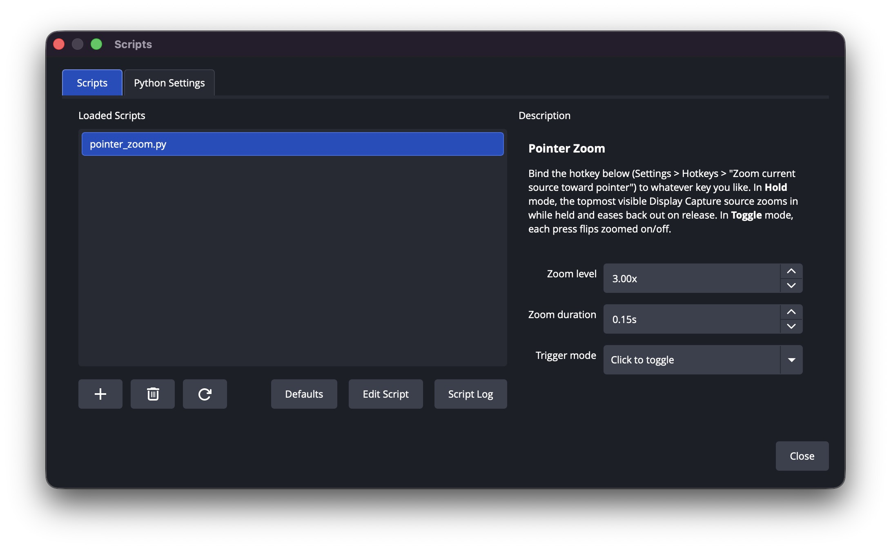

# obs-pointer-zoom

Trigger a hotkey in OBS Studio to zoom the topmost visible macOS Screen
Capture source (Display, Window, or Application capture) toward your
mouse pointer, and ease smoothly back out when you're done.

Runs entirely as a single OBS Python script, no separate process, no
obs-websocket. See [AGENTS.md](AGENTS.md) for how it works and how to
develop it further.

[**Watch a demo**](images/zoom-demo-google.mp4)

## Requirements

- macOS, OBS Studio (built/tested against 32.1.2).
- A Python **framework** build that OBS's scripting can load, with
  [pyobjc](https://pyobjc.readthedocs.io/) installed into it.

## Setup

1. Install a framework Python if you don't already have one OBS can use, e.g.:

   ```
   brew install python@3.11
   ```

2. Point OBS at it: **Tools > Scripts > Python Settings**, and set the path to:

   ```
   /opt/homebrew/opt/python@3.11/Frameworks/Python.framework/Versions/3.11
   ```

3. Install pyobjc into that same interpreter:

   ```
   /opt/homebrew/opt/python@3.11/bin/pip3.11 install pyobjc
   ```

4. In OBS: **Tools > Scripts > +**, add `pointer_zoom.py` from this repo.

5. **Settings > Hotkeys**, find "Zoom current source toward pointer", and
   bind it to whatever key you like — a lone modifier (Left Shift) works,
   as does a remapped key (e.g. Caps Lock remapped to F18, handy if you
   don't want Shift itself triggering the zoom while typing in other apps).

## Usage

Trigger your bound key (click it once in the default **Click to toggle**
mode, or hold it down in **Hold to zoom** mode). The topmost
enabled/visible Screen Capture source in the current scene zooms toward
wherever your mouse currently is, regardless of what's selected in the
Sources list, and eases back out when you toggle/release. Works with any
of the source's three capture methods (Display, Window, or Application).

As the pointer nears an edge or corner of the screen, the zoomed view
locks flush against it instead of requiring the pointer to reach the
exact physical edge pixel — how close it needs to get depends on the
zoom level (more zoom = less margin needed).

## Configuration



In OBS: **Tools > Scripts**, select `pointer_zoom.py`, and use its
settings panel (bottom of the window) to adjust:

- **Zoom level** — how far it zooms in, default **3.00x**
- **Zoom duration** — roughly how long the ease in/out takes, default **0.15s**
- **Trigger mode** — default **Click to toggle** (each press flips zoomed
  on/off), or **Hold to zoom** (zoomed while the key is down, eases back
  out on release)

Changes apply immediately, no restart needed. These are just the
script's defaults for a fresh install — once you've changed a value it's
saved with the rest of your scene collection, so it'll stick around
across OBS restarts.

Only the macOS Screen Capture source is supported — the zoom is anchored
to a real pixel of real on-screen content, which only makes sense for a
source that's actually mirroring some.
